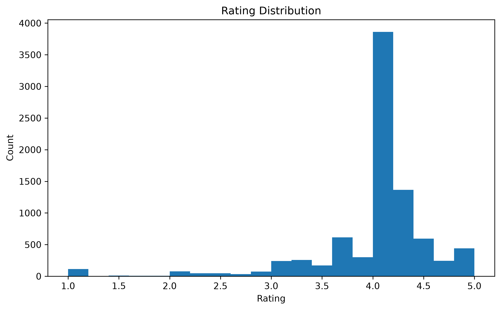
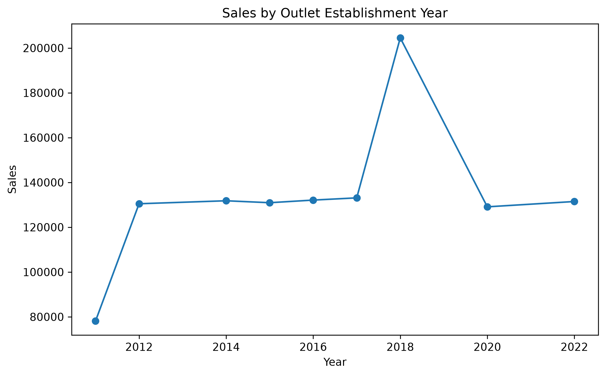

# 🛒 Blinkit Sales Analytics

## 📌 Project Overview

This project analyzes Blinkit's grocery sales data using SQL and Python to uncover sales trends, evaluate outlet performance, and generate actionable business insights. The analysis includes data cleaning, exploratory data analysis (EDA), SQL-based business queries, and data visualizations.

---

## 🎯 Objectives

- Analyze overall sales performance.
- Identify the highest-performing product categories.
- Compare sales across outlet types, outlet sizes, and locations.
- Evaluate customer ratings and product visibility.
- Generate business insights to support data-driven decision-making.

---

## 🛠️ Tech Stack

- **SQL (MySQL)**
- **Python**
- **Pandas**
- **NumPy**
- **Matplotlib**
- **Jupyter Notebook**

---

## 📂 Dataset

- **Records:** 8,523
- Product Information
- Outlet Details
- Sales
- Ratings
- Item Visibility

---

## 📊 Project Workflow

1. Data Cleaning
2. Data Preprocessing
3. Exploratory Data Analysis (EDA)
4. SQL Analysis
5. Business Insights
6. Data Visualization

---

## 📈 Key Business Insights

- 🥇 Fruits and Vegetables generated the highest sales (**₹178,124.08**).
- 🏪 Supermarket Type1 contributed the highest revenue (**₹787,549.89**).
- 📦 Medium-sized outlets generated the maximum sales.
- 📍 Tier 3 outlets achieved the highest revenue.
- ⭐ Meat category received the highest average customer rating.
- 📅 Outlets established in **2018** recorded the highest sales.

---

# 📊 Visualizations

### Sales by Item Type


---

### Sales by Outlet Type


---

### Sales by Outlet Size


---

### Sales Distribution


---

### Rating Distribution



---

### Sales vs Rating


---

### Average Rating by Item Type



---

### Top 10 Selling Products


---

## 📁 Repository Structure

```text
Blinkit-Sales-Analytics
│
├── Dataset
│   └── BlinkIT-Grocery-Data.csv
│
├── Images
│   ├── sales_by_item_type.png
│   ├── sales_by_outlet_type.png
│   ├── sales_by_outlet_size.png
│   └── ...
│
├── SQL
│   ├── Advanced Business Analysis.sql
│   ├── Business_KPI_Analysis_02.sql
│   ├── Sales Analysis.sql
│   └── data_exploration_B01.sql
│
├── Blinkit_Analysis.ipynb
├── README.md
└── requirements.txt
```

---

## 🚀 How to Run

1. Clone the repository.
2. Install the required libraries:

```bash
pip install -r requirements.txt
```

3. Open `Blinkit_Analysis.ipynb` in Jupyter Notebook or JupyterLab.
4. Run the notebook cells sequentially.

---

## 🚀 Future Improvements

- Develop an interactive Power BI dashboard.
- Build a SQL reporting dashboard.
- Perform predictive sales forecasting using machine learning.

---

## 👩‍💻 Author

**Samiksha Chourasia**

GitHub: https://github.com/your-username
