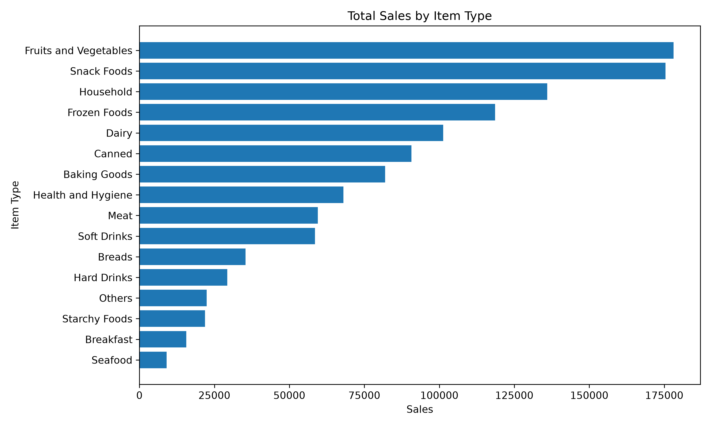
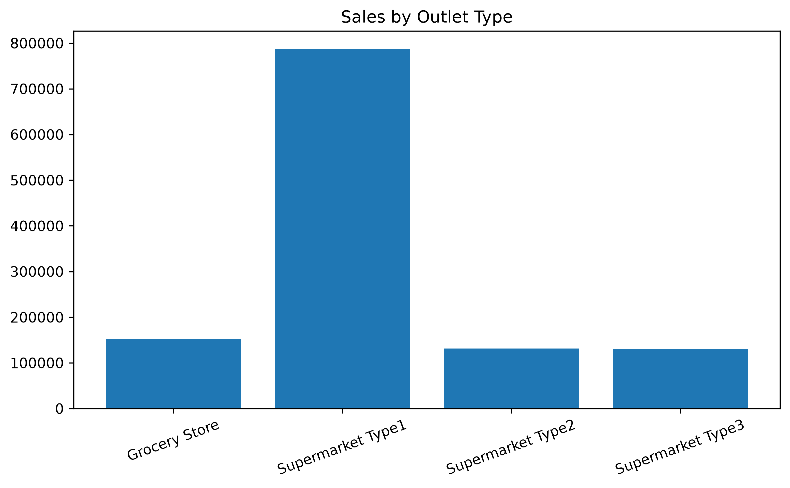
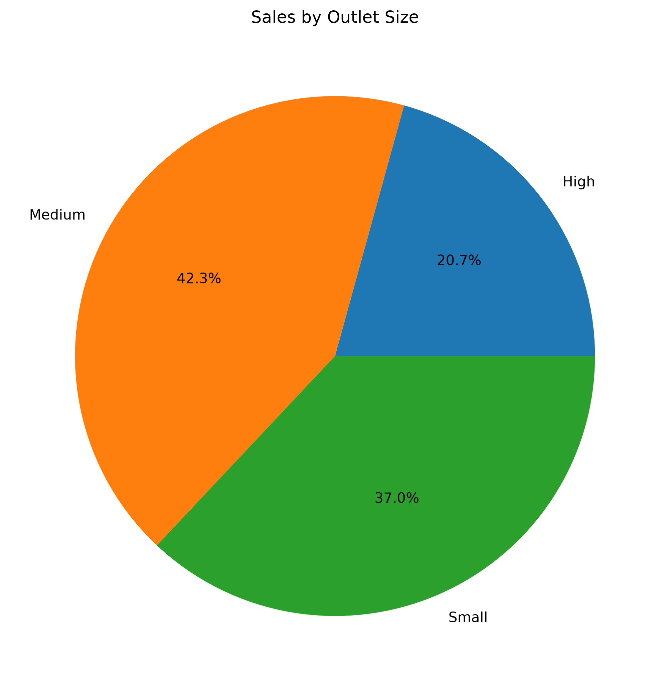
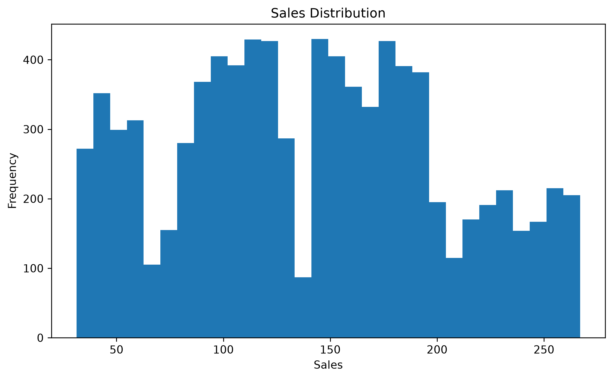
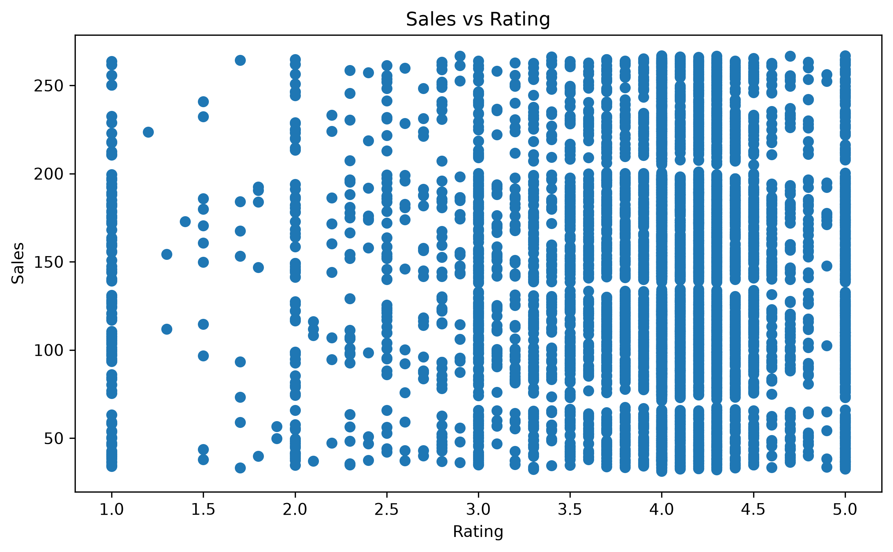
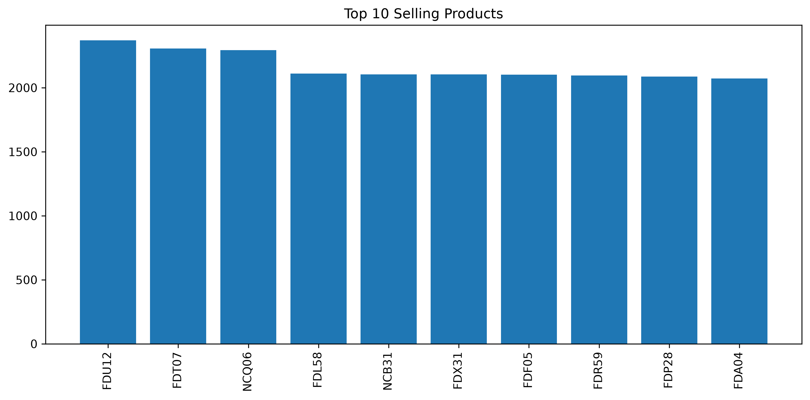

# 🛒 Blinkit Sales Analytics

## 📌 Project Overview

This project analyzes Blinkit's grocery sales data using **SQL** and **Python** to uncover sales trends, evaluate outlet performance, and generate actionable business insights. The project covers data cleaning, exploratory data analysis (EDA), SQL-based business queries, and data visualization.

---

## 🎯 Project Objectives

- Analyze overall sales performance.
- Identify the highest-performing product categories.
- Compare sales across outlet types, outlet sizes, and locations.
- Evaluate customer ratings and product visibility.
- Generate business insights to support data-driven decision-making.

---

## 🛠️ Tech Stack

- SQL (MySQL)
- Python
- Pandas
- NumPy
- Matplotlib
- Jupyter Notebook

---

## 📂 Dataset

The dataset contains **8,523 retail records** including:

- Product Information
- Outlet Details
- Sales
- Customer Ratings
- Item Visibility

---

## 📊 Project Workflow

- Data Cleaning
- Data Preprocessing
- Exploratory Data Analysis (EDA)
- SQL Analysis
- Business Insights
- Data Visualization

---

## 📈 Key Business Insights

- 🥇 Fruits and Vegetables generated the highest sales (**₹178,124.08**).
- 🏪 Supermarket Type1 contributed the highest total revenue (**₹787,549.89**).
- 📦 Medium-sized outlets generated the highest sales.
- 📍 Tier 3 outlets achieved the highest revenue.
- ⭐ Meat category received the highest average customer rating.
- 📅 Outlets established in **2018** recorded the highest sales.

---

# 📊 Project Visualizations

### Sales by Item Type



---

### Sales by Outlet Type



---

### Sales by Outlet Size



---

### Sales Distribution



---

### Sales vs Rating



---

### Top 10 Selling Products



---

## 📁 Repository Structure

```text
Blinkit-Sales-Analytics
│
├── Dataset
│   └── BlinkIT-Grocery-Data.csv
│
├── Images
│   ├── average_rating_by_item_type.png
│   ├── item_visibility_distribution.png
│   ├── rating_distribution.png
│   ├── sales_by_establishment_year.png
│   ├── sales_by_item_type.png
│   ├── sales_by_outlet_size.png
│   ├── sales_by_outlet_type.png
│   ├── sales_distribution.png
│   ├── sales_vs_rating.png
│   └── top_10_selling_products.png
│
├── SQL
│   ├── Advanced Business Analysis.sql
│   ├── Business_KPI_Analysis_02.sql
│   ├── Sales Analysis.sql
│   └── data_exploration_B01.sql
│
├── Blinkit_Analysis.ipynb
├── README.md
└── requirements.txt
```

---

## ▶️ How to Run

1. Clone the repository

```bash
git clone https://github.com/samiksha020704/Blinkit-Sales-Analytics.git
```

2. Install the required libraries

```bash
pip install -r requirements.txt
```

3. Open **Blinkit_Analysis.ipynb** in Jupyter Notebook or JupyterLab.

4. Run the notebook cells sequentially.

---

## 🚀 Future Improvements

- Develop an interactive Power BI dashboard.
- Build a SQL reporting dashboard.
- Perform predictive sales forecasting using machine learning.

---

## 👩‍💻 Author

**Samiksha Chourasia**

GitHub: https://github.com/samiksha020704
